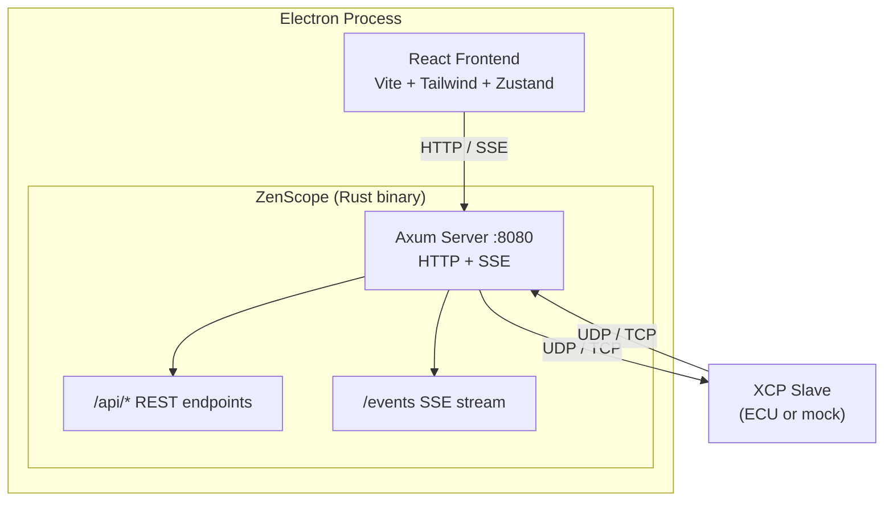

# Architecture

Electron spawns the Rust backend as a sidecar process. The Axum server runs independently — there's no separate backend to manage. A Python mock slave is included for development and testing without real hardware.

## Tech Stack

| Layer | Technology |
|-------|-----------|
| Desktop shell | Electron |
| Backend | Rust, Axum, tokio, rusqlite |
| Frontend | React 19, TypeScript, Vite, Tailwind CSS, Zustand |
| Protocol | XCP on Ethernet (UDP/TCP), ASAM standard |
